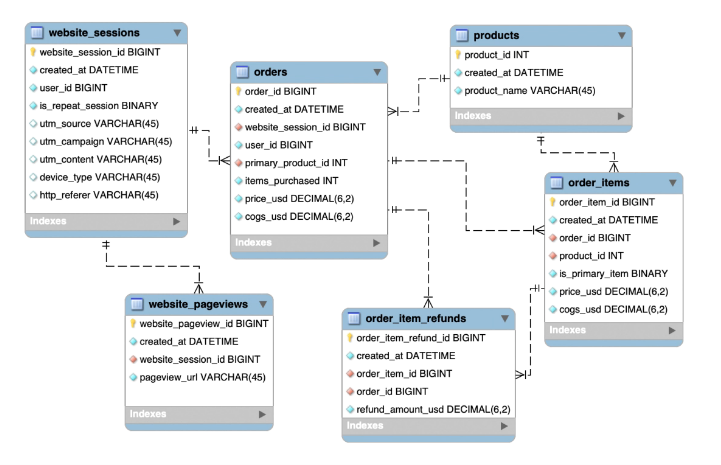

The scripts for creating the database and inserting records into the tables were originally created by the instructor of the [Advanced SQL course](https://www.udemy.com/course/advanced-sql-mysql-for-analytics-business-intelligence/)

The scripts were reorganized and divided into several files just to organize this repository. To understand the database model here is the diagram created by the instructor of the course:
