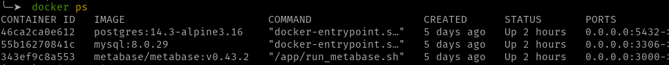

# course-advanced-mysql-for-analysis-and-bi

This is a repository dedicated to the [Advanced MySQL for Analysis and BI course](https://www.udemy.com/course/advanced-sql-mysql-for-analytics-business-intelligence/).

The course is focused on advanced SQL for analysis and business intelligence, as its name suggests, **but I chose to create its own structure to maintain the portability of the course, and can run the queries at any time and even create some dashboards. Thus, outside the scope of the course, a docker application was created.**

## Infrastructure

- **MySQL Instance**: performs the creation of the MySQL database used in the course.
- **Metabase + Postgres Instances**: I can run the queries created during the course on Metabase, and thus maintain views and insights. Postgres is the Metabase metadata database.

The entire Docker application is structured in the [compose.yaml](compose.yaml) file.
Just to streamline the container management process, the script [GO](go.sh) was created where:

- `./go.sh setup`: create and start the containers. Must execute just in the first time.
- `./go.sh start`: start all containers already created.
- `./go.sh stop` : stop all running containers.
- `./go.sh down` : stop and remove all containers.
- `./go.sh bash` : access the MySQL container bash.

## The content structure

The course is divided in 12 sections and the ones covered in this repository are from 4 to 11. 
Every section has:
- The case to solve with SQL
- The SQL code solution
- The results from the SQL code execution on Metabase

### [00 The database description](.db-setup/README.md)
Understand the tables and relationships of the database on which we are running these queries.

### [01 Traffic source analysis](./queries/01-analyzing-traffic-sources/README.md)
### [02 Analysing website performance](./queries/02-analyzing-website-performance/README.md)
### [03 Mid course project](./queries/03-mid-course-project/README.md)
### [04 Analysis for channel portfolio management](./queries/04-analysis-for-channel-portfolio-management/README.md)
### [05 Analyzing business patterns and seasonality](./queries/05-analyzing-business-patterns-and-seasonality/README.md)
### [06 Product analysis](./queries/06-product-analysis/README.md)
### [07 User analysis](./queries/07-user-analysis/README.md)
### [08 Final project](./queries/08-final-project/README.md)