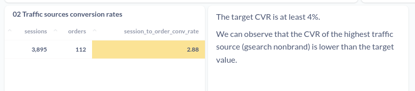

# Analyzing Traffic Sources
Content based on Section 4 of the course Advanced SQL: MySQL Data Analysis & Business Intelligence

## Index

- [00 Context](#context)
- [01 Finding top traffic sources](#01-finding-top-traffic-sources)
- [02 Traffic sources conversion rates](#02-traffic-sources-conversion-rates)
- [03 Traffic source trending](#03-traffic-source-trending)
- [04 Bid Optimization for paid traffic](#04-bid-optimization-for-paid-traffic)
- [05 Trending with granular segments](#05-trending-with-granular-segments)

## Context
### Traffic source analysis
Where your customers are coming from and which channels are driving the highest quality traffic.

Channels can be:
- Email
- Social
- Search
- Direct

### Conversion Rates 
Percent that converts to sales.

UTM - Urchin Traffic Monitor: parameters are five variants of URL parameters used by marketers to track the effectiveness of online marketing campaigns across traffic sources and publishing media. 

When businesses run paid marleting campaigns, they often obsess over performance and measure everything:
- How much they spend
- How well traffic converts to sales
- etc...

Paid traffic is commonly tagged with tracking (UTM) paramters, which are appended to URLs and allows us to tie website activity back to specific traffic sources and campaigns.

---
## 01 Finding top traffic sources
### Case
We've been live for almost a month now and we're starting to generate sales. Can you help me understand **where the bulk of our website sessions are coming from**, from yesterday?
I'd like to see a breakdown by **UTM source, campaign and referring domain**. Thanks!

### What to do
The objective is to show where the volume of website traffic comes from, that is, where the website sessions come from. That is, we need to build count by TM source, campaign and referring domain and evidence from highest to lowest.

### Results
#### [SQL query](01-top-traffic-sources.sql)

#### 

---
## 02 Traffic sources conversion rates
### Case
Sounds like **gsearch nonbrand** is our major traffic source, nut we need to understand if those sessions are driving sales. 
**Calculate the conversion rate (CVR) from session order.** Out **CVR target is at least 4%**, to make the numbers work.
If we are much lower, we'll need to reduce bids. If we are higher, we can increase nids to drive more volume.

### What to do
Structure of the expected result:

| sessions 	| orders 	| session_to_order_conv_rate 	|
|----------	|--------	|----------------------------	|
|          	|        	|                            	|

### Results
### [SQL query](02-traffic-sources-conversion-rates.sql)
#### 

---
## 03 Traffic source trending
### Case
We **bid down gsearch nonbrand** on 2012-04-15. Please, pull **gsearch nonbrand trended session volume, by week**, to see if the bid changes have caused volume to drop at all.

### What to do
Structure of the expected result:

| week_start_date 	| sessions 	|
|-----------------	|----------	|
| value           	| value    	|

### Results
### [SQL query](03-traffic-source-trending.sql)
#### 

---
## 04 Bid optimization for paid traffic
### Case
Pull conversion rates from session to order, by device. If desktop performance is better than on mobile we may be able to bid up for desktop specifically to get more volume...
### What to do
Structure of the expected result:

| device_type 	| sessions 	| orders 	| session_to_order_conv_rate 	|
|-------------	|----------	|--------	|----------------------------	|
| value       	| value    	| value  	| value                      	|

### Results
### [SQL query](04-bid-optimization-for-paid-traffic.sql)
#### 

---
## 05 Trending with granular segments
### Case
We bid our gsearch nonbrand desktop campaigns up on 2012-05-19. Pull weekly trends for both desktop and mobile, so we can see the impact on volume. You can use 2012-04-15 until the bid change as a baseline.
### What to do
Structure of the expected result:

| week_start_date 	| dtop_sessions 	| mod_sessions 	|
|-----------------	|---------------	|--------------	|
| value           	| value         	| value        	|

### Results
### [SQL query](05-trending-w-granular-segments.sql)
#### 