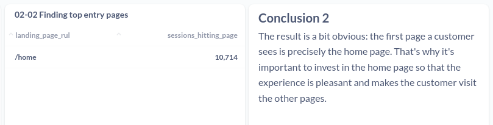

# Analyzing website performance
Content based on Section 5 of the course Advanced SQL: MySQL Data Analysis & Business Intelligence

## Index

- [00 Context](#context)
- [01 Finding top website pages](#01-finding-top-website-pages)
- [02 Finding top entry pages](#02-finding-top-entry-pages)
- [03 Calculating bounce rates](#03-calculating-bounce-rates)
- [04 Analyzing landing page tests](#04-analyzing-landing-page-tests)
- [05 Landing page trend analysis](#05-landing-page-trend-analysis)
- [06 Building conversion funnels](#06-buildind-conversion-funnels)
- [07 Analyzing conversion funnel tests](#07-analyzing-conversion-funnel-tests)

## Context
Website content analysis is about understanding which pages are seen the most by your users, to identify where to focus on improving your business. Common use cases:
- Finding the most-viewed pages that customers view on your website.
- Identifying the most common entry pages to your website - the first thing a user sees
- For most-viewed pages and most comm.on entry pages, understanding how those pages perform for your business objectives.
---
## 01 Finding top website pages
### Case
Pull the most-viewed website pages, ranked by session volume, until 2012-06-09.

### What to do
Structure of the expected result:

| pageview_url 	| sessions 	|
|--------------	|----------	|
| value        	| value    	|

### Results
### [SQL query](01-finding-top-website-pages.sql)
#### 

--- 
## 02 Finding top entry pages
### Case
Pull a list of the top entry pages and rank them on entry volume. I want to confirm where our users are hitting the site.
Each session can have more than one pageview associated, that is, the customer in the same session will view several pages of the website. 
This way:
1 Find the first pageview (pageview_id) for each session (website_session_id)
2 Find the url the customer saw on that first pageview

### What to do
Structure of the expected result:

| landing_page 	| sessions_hitting_this_landing_page 	|
|--------------	|------------------------------------	|
| value        	| value                              	|

### Results
### [SQL query](02-finding-top-entry-pages.sql)
#### 