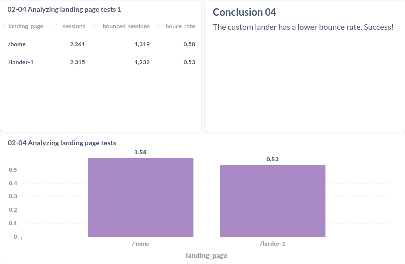

# Analyzing website performance
Content based on Section 5 of the course Advanced SQL: MySQL Data Analysis & Business Intelligence

## Index

- [00 Context](#context)
- [01 Finding top website pages](#01-finding-top-website-pages)
- [02 Finding top entry pages](#02-finding-top-entry-pages)
- [03 Calculating bounce rates](#03-calculating-bounce-rates)
- [04 Analyzing landing page tests](#04-analyzing-landing-page-tests)
- [05 Landing page trend analysis](#05-landing-page-trend-analysis)
- [06 Building conversion funnels](#06-buildind-conversion-funnels)
- [07 Analyzing conversion funnel tests](#07-analyzing-conversion-funnel-tests)

## Context
Website content analysis is about understanding which pages are seen the most by your users, to identify where to focus on improving your business. Common use cases:
- Finding the most-viewed pages that customers view on your website.
- Identifying the most common entry pages to your website - the first thing a user sees
- For most-viewed pages and most common entry pages, understanding how those pages perform for your business objectives.
- Building and analyzing conversion funnels: is about understanding and optimizing each step of your user's experience on their journey toward purchasing your products. Identify the percentage of the users that move to the each step of our flow until the goal (by a product, for an example).

Common use cases of funnels:
- Identifying the most common paths customers take before purchasing your products
- Identifying how many of your users continue on to each next step in your conversion flow, and how many users abandon at each step
- Optimizing critical pain points where users are abandoning, so that you can convert more users and sell more products
---
## 01 Finding top website pages
### Case
Pull the most-viewed website pages, ranked by session volume, until 2012-06-09.

### What to do
Structure of the expected result:

| pageview_url 	| sessions 	|
|--------------	|----------	|
| value        	| value    	|

### Results
### [SQL query](01-finding-top-website-pages.sql)
#### 

--- 
## 02 Finding top entry pages
### Case
Pull a list of the top entry pages and rank them on entry volume. I want to confirm where our users are hitting the site.
Each session can have more than one pageview associated, that is, the customer in the same session will view several pages of the website. 
This way:
1 Find the first pageview (pageview_id) for each session (website_session_id)
2 Find the url the customer saw on that first pageview

### What to do
Structure of the expected result:

| landing_page 	| sessions_hitting_this_landing_page 	|
|--------------	|------------------------------------	|
| value        	| value                              	|

### Results
### [SQL query](02-finding-top-entry-pages.sql)
#### 

---
## 03 Calculating bounce rates
### Case
Since we checked that all of our traffic is landing on the homepage right now we should check how that landing page is performing.
Pull bounce rates for traffic landing on the homepage, with three numbers: **sessions, bounced sessions and % of sessions which bounced (Bounce Rate).**

Remember:
- website bounce rate = single-page sessions / total sessions
- page bounce rate = single-page sessions on the page / total sessions starting from the page
If 50 users land on your homepage and 2 of them **exit without triggering another request**, the homepage has a bounce rate of 4%.
- Every bounce is an exit, but not every exit is a bounce.

### What to do
Structure of the expected result:

| sessions 	| bounced_sessions 	| bounce_rate 	|
|----------	|------------------	|-------------	|
| value    	| value            	| value       	|

### Results
### [SQL query](03-calculating-bounce-rates.sql)
#### 

---
## 04 Analyzing landing page tests
### Case
Based on the bouce rate analysis we ran a new custom landing page (/lander-1) in a 50/50 test against the homepage (/home).

**Pull bounce rates for the two groups. Just look at the time period where /lander-1 was getting traffic.**

### What to do
Structure of the expected result:

| landing_page 	| total_sessions 	| bounced_sessions 	| bounce_rate 	|
|--------------	|----------------	|------------------	|-------------	|
| value        	| value          	| value            	| value       	|

### Results
### [SQL query](04-analyzing-landing-page-tests.sql)
#### 

---
## 05 Landing page trend analysis
### Case
Pull the volume of paid search nonbrand traffic landing on /home and /lander-1, trended weekly since June 1st, to confirm if the traffic is all routed correctly. Pull our overall paid search bounce rate trended weekly, to make sure the lander change has improved the overall picture.

### What to do
Structure of the expected result:

| week_start_date 	| bounce_rate 	| home_sessions 	| lander_sessions 	|
|-----------------	|-------------	|---------------	|-----------------	|
| value           	| value       	| value         	| value           	|

### Results
### [SQL query](05-landing-page-trend-analysis.sql)
#### 

---
## 06 Building conversion funnels
### Case
We must understand where we lose out gsearch visitors between the new /lander-1 page and placing an order. Can you build us a full conversion funnel, analyzing how many customers make it to each step? 

Start with /lander-1 and build the funnel all the way to out thank you page. Please use data since August 5th.

### What to do
Structure of the expected result:

| sessions 	| to_products 	| to_mrfuzzy 	| to_cart 	| to_shipping 	| to_billing 	| to_thankyou 	|
|----------	|-------------	|------------	|---------	|-------------	|------------	|-------------	|
| value    	| value       	| value      	| value   	| value       	| value      	| value       	|

| lander_click_rt 	| products_click_rt 	| mrfuzzy_click_rt 	| cart_click_rt 	| shipping_click_rt 	| billing_click_rate 	|
|-----------------	|-------------------	|------------------	|---------------	|-------------------	|--------------------	|
| value           	| value             	| value            	| value         	| value             	| value              	|

### Results
### [SQL query](06-building-conversion-funnels.sql)
#### 

---
## 07 Analyzing conversion funnel tests
### Case

### What to do
Structure of the expected result:

| week_start_date 	| bounce_rate 	| home_sessions 	| lander_sessions 	|
|-----------------	|-------------	|---------------	|-----------------	|
| value           	| value       	| value         	| value           	|

### Results
### [SQL query](07-analyzing-conversion-funnel-tests.sql)
#### 